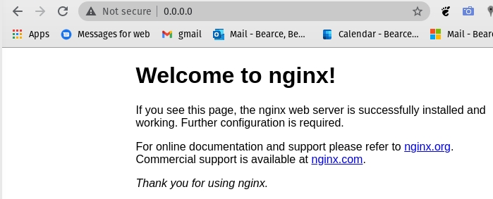

# flask_w_nginx

## Step 1 - Install Nginx
> [source](https://www.digitalocean.com/community/tutorials/how-to-install-nginx-on-ubuntu-18-04)
```bash
$ sudo apt update
$ sudo apt install nginx
```

## Step 2 - Adjusting the Firewall

```bash
$ sudo ufw apt list
Available applications:
  CUPS
  Nginx Full
  Nginx HTTP
  Nginx HTTPS
```

Enable HTTP this by typing:
```bash
$ sudo ufw allow 'Nginx HTTP'
Rules updated
Rules updated (v6)
```

> Sometimes nginx ix still inactive

```bash
$ sudo ufw status
Status: inactive
```

> Use this to enable it:

```
$ sudo ufw enable
Firewall is active and enabled on system startup
$ sudo ufw status
Status: active

To                         Action      From
--                         ------      ----
Nginx HTTP                 ALLOW       Anywhere                  
Nginx HTTP (v6)            ALLOW       Anywhere (v6)
```

## Step 3 - Checking Your Web server

> It should already be up and running

```bash
$ systemctl status nginx
● nginx.service - A high performance web server and a reverse proxy server
     Loaded: loaded (/lib/systemd/system/nginx.service; enabled; vendor preset: enabled)
     Active: active (running) since Sun 2021-01-17 11:30:46 EST; 13min ago
       Docs: man:nginx(8)
   Main PID: 334131 (nginx)
      Tasks: 9 (limit: 28605)
     Memory: 9.1M
     CGroup: /system.slice/nginx.service
             ├─334131 nginx: master process /usr/sbin/nginx -g daemon on; master_process on;
             ├─334132 nginx: worker process
             ├─334133 nginx: worker process
             ├─334134 nginx: worker process
             ├─334135 nginx: worker process
             ├─334136 nginx: worker process
             ├─334137 nginx: worker process
             ├─334138 nginx: worker process
             └─334139 nginx: worker process

Jan 17 11:30:46 pop-os systemd[1]: Starting A high performance web server and a reverse proxy>
Jan 17 11:30:46 pop-os systemd[1]: Started A high performance web server and a reverse proxy >
```

As you can see above, the service appears to have started successfully. However, the best way to test this is to actually request a page from Nginx.


> I used ```0.0.0.0``` but we can use our server IP too

Try typing this at your server’s command prompt:

```bash
$ ip addr show eth0 | grep inet | awk '{ print $2; }' | sed 's/\/.*$//'
```
> that didn't work for me so I delete the ```eth0``` from the command

```bash
$ ip addr show eth0 | grep inet | awk '{ print $2; }' | sed 's/\/.*$//'
Device "eth0" does not exist.
$ ip addr show | grep inet | awk '{ print $2; }' | sed 's/\/.*$//'
127.0.0.1
::1
192.168.86.37
fe80::928c:d8ac:88cd:4a51
172.17.0.1
192.168.64.1
10.251.224.224
fe80::c757:385e:ab7b:53d1
fe80::fe71:628e:c254:97bb
```

> These worked for me: ```localhost```, ```127.0.0.0```, ```0.0.0.0```, ```192.168.86.37```, ```172.17.0.1```, ```192.168.64.1``` and ```10.251.224.224```.
